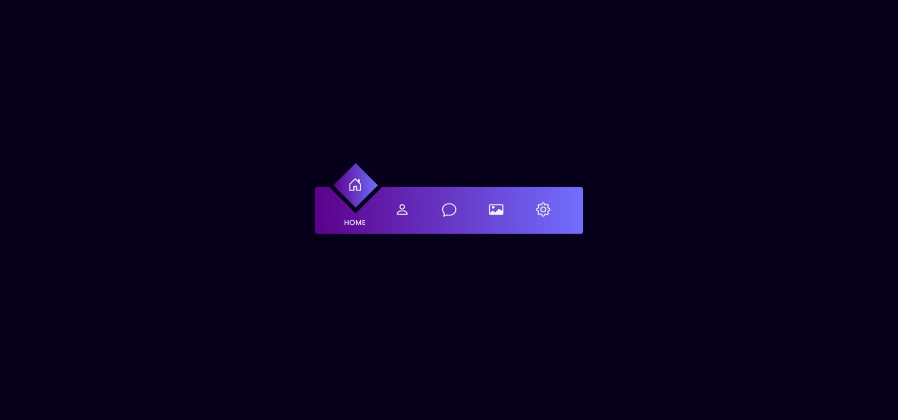

# 🟣 Magic Navigation Bar (Square Indicator)

A **modern navigation bar** with a **diamond-shaped (rotated square) indicator** animation.
Built with **HTML**, **CSS**, and **Vanilla JavaScript**, featuring a smooth transition effect and gradient purple theme inspired by futuristic UI design.

🔗 **[Live Demo](https://nsnet21.github.io/15-magic-navigation-bar-square/)**

---

## 🖼️ Preview



---

## 🚀 Features

- 🟪 **Diamond Indicator Animation** — moves dynamically between menu items
- 🎨 **Gradient Purple Theme** — elegant UI using `linear-gradient` and custom CSS variables
- 🧭 **Active State Transition** — smoothly toggles between menu icons
- ⚡ **Pure Front-End Logic** — no frameworks, only HTML + CSS + JS
- 🧩 **Responsive & Reusable** — easy to adapt to various layouts

---

## 🧰 Built With

| Stack                  | Usage                                               |
| :--------------------- | :-------------------------------------------------- |
| **HTML5**              | Structure of navigation menu                        |
| **CSS3**               | Animation, gradient theme, and shape transformation |
| **Vanilla JavaScript** | Handles active menu state & interaction logic       |
| **Bootstrap Icons**    | Icon set for navigation items                       |

---

## 🧠 How It Works

1. The `.indicator` div is positioned absolutely and rotated 45° to form a diamond shape.
2. Each `.list` item in the navigation has an `active` class toggle.
3. When an item is clicked:
   - The active class is removed from all items.
   - The clicked item becomes active.
   - The `.indicator` shifts position using CSS `translateX()` and `rotate()`.
4. Smooth transitions are achieved using the `cubic-bezier(0.68, -0.55, 0.27, 1.55)` timing function.

---

## 📄 File Structure

```
15Magic-Navigation-Bar-Square/
│
├── assets-preview/
│ └── preview.jpg
├── index.html
├── style.css
├── script.js
├── README.md
├── .gitignore
└── .gitattributes
```

---

## 🎨 Color Palette

| Variable                | Description        | Example   |
| :---------------------- | :----------------- | :-------- |
| `--accent-400`          | Main violet accent | `#6933ff` |
| `--electric-violet-500` | Gradient highlight | `#726eff` |
| `--accent-950`          | Background base    | `#07001a` |

---

## 💡 Learning Focus

- **CSS gradient** and cubic-bezier transitions
- **Transform & rotate logic** for geometric indicators
- **JavaScript class toggling** and **active-state** animation
- **Clean variable-based color** theming system

---

## 📘 Technical Notes

### 🔹 Indicator Movement Logic

```css
.navigation ul li:nth-child(1).active ~ .indicator {
  transform: translateX(calc(100px * 0)) rotate(calc(45deg + (90deg * 0)));
}
.navigation ul li:nth-child(2).active ~ .indicator {
  transform: translateX(calc(100px * 1)) rotate(calc(45deg + (90deg * 1)));
}
```

- Each `nth-child()` defines the horizontal shift `(translateX)` of the diamond.
- The rotation increases by `90°` every step, producing a continuous spin illusion.
- The `~` sibling selector ensures `.indicator` reacts dynamically when the sibling `<li>` is active.

### 🔹 Animation Timing Function

```css
transition: all 0.5s cubic-bezier(0.68, -0.55, 0.27, 1.55);
```

This custom **easing curve** creates a _“spring bounce”_ effect — moving quickly at first, overshooting slightly, and then snapping smoothly into place.

## 🔹 Active State Elevation

```css
.list.active .icon {
  transform: translateY(-53px);
}
.list.active .text {
  opacity: 1;
  transform: translateY(2px);
}
```

- Icons rise upward while text fades in.
- Both transitions are synchronized using identical bezier curves and delays, giving a unified motion feeling.

---

## 📚 License

This project is open-source and available for learning and portfolio use.
Feel free to fork and experiment with it.

---

**Created by [Nate](https://github.com//NSNet21)** — 🔥 Passion for clean, animated UI and modern front-end design.
